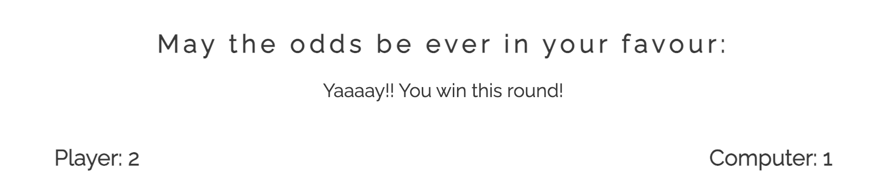
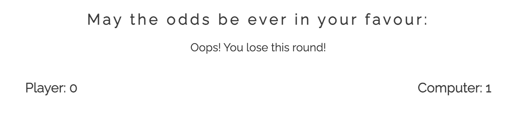
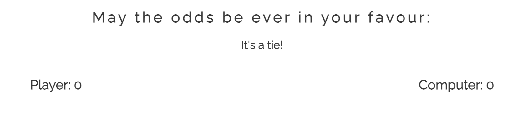

# Rock, Paper, Scissors, Lizard, Spock

Rock, Paper, Scissors, Lizard, Spock is a game for you to enjoy. The idea for the game came from the famous show 'The Big Bang Theory'. This particular designed game will allow you to play against the computer. It is suitable for all ages. The player must reach 10 points in order to beat the computer and be crowned the Rock, Paper, Scissors, Lizard, Spock champion! But should you lose, not to worry. The game will reset after a couple of seconds and allow you to try again! May the odds be ever in your favour!! 

Please follow the link below to the Webpage -

[Rock, Paper, Scissors, Lizard, Spock](https://8000-diarmaidmcdonald-rock-pa-91k0mqd411.us2.codeanyapp.com/)

## Features

### Heading and Picture of Hand Signs

As shown above, the title of the page is Rock, Paper, Sciossors, Lizard, Spock. It also has a photo underneath showing which hand signs to use for each choice. 

### Scoreboard

Above you will find the scoreboard displayed with comments should you win, lose, or draw each round. Once the game is complete you will be also shown an additional message confirming who won the game before the game resets.
The Javascript choose a random option for the computer. 
The result and score are clearly displayed above the options.

The icons above are the options to choose from. Once hovered over, the icons will cahnge colour allowing for the user to be 100% certain of their choice. 

Here you will find the rules of the game. May the odds be ever in your favour!! 